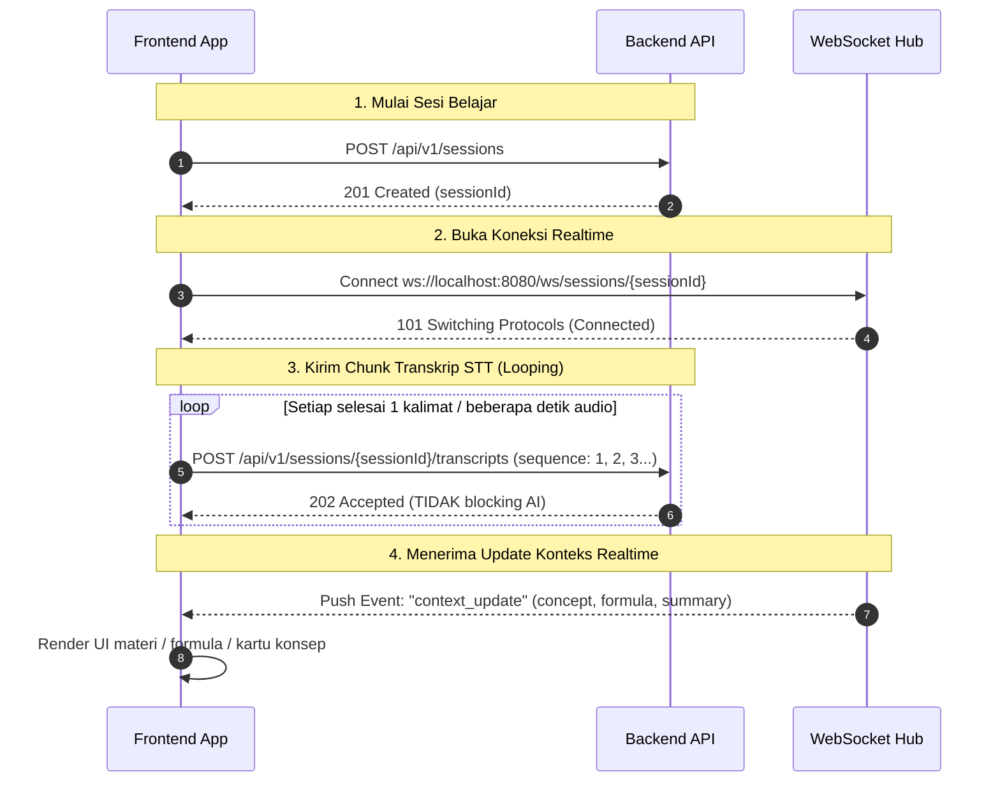

# Frontend API & Realtime Integration Guide

Panduan integrasi resmi untuk Frontend (FE) yang menghubungkan antarmuka pembelajaran dengan Backend Context Engine.

---

## 1. Quick Info & Base URL

| Service | Protocol | Base URL (Local Development) |
|---|---|---|
| **REST API** | `HTTP/1.1` | `http://localhost:8080/api/v1` |
| **Realtime Stream** | `WebSocket` | `ws://localhost:8080/ws` |

---

## 2. Alur Integrasi Frontend (Recommended Flow)



---

## 3. Format Respons Standar API

Semua respons HTTP REST API menggunakan struktur seragam:

### Respons Sukses (`meta.success: true`)
```json
{
  "meta": {
    "success": true,
    "message": "Deskripsi sukses"
  },
  "data": { ... }
}
```

### Respons Gagal (`meta.success: false`)
```json
{
  "meta": {
    "success": false,
    "message": "Pesan error"
  },
  "data": null,
  "errors": "Rincian pesan validasi atau alasan kegagalan"
}
```

---

## 4. REST API Reference

### 4.1 Create Learning Session
Membuat sesi pembelajaran baru sebelum audio/STT dimulai.

- **Endpoint**: `POST /api/v1/sessions`
- **Headers**: `Content-Type: application/json`
- **Request Body**:
  ```json
  {
    "subject": "Fisika",
    "topic": "Dinamika",
    "subtopic": "Hukum Newton"
  }
  ```
- **Response `201 Created`**:
  ```json
  {
    "meta": {
      "success": true,
      "message": "Session created successfully"
    },
    "data": {
      "id": "e4b2d184-7a0e-4f3b-bcf2-1a2f64321098",
      "subject": "Fisika",
      "topic": "Dinamika",
      "subtopic": "Hukum Newton",
      "status": "active",
      "createdAt": "2026-10-09T10:30:00Z",
      "updatedAt": "2026-10-09T10:30:00Z"
    }
  }
  ```

---

### 4.2 Get Session Detail
Mengambil informasi dan status sesi.

- **Endpoint**: `GET /api/v1/sessions/:id`
- **Response `200 OK`**:
  ```json
  {
    "meta": {
      "success": true,
      "message": "Session retrieved successfully"
    },
    "data": {
      "id": "e4b2d184-7a0e-4f3b-bcf2-1a2f64321098",
      "subject": "Fisika",
      "topic": "Dinamika",
      "subtopic": "Hukum Newton",
      "status": "active",
      "createdAt": "2026-10-09T10:30:00Z",
      "updatedAt": "2026-10-09T10:30:00Z"
    }
  }
  ```

---

### 4.3 Ingest Transcript Chunk (STT Delta)
Mengirimkan potongan teks suara secara berkala. Endpoint ini merespons langsung dengan `202 Accepted` tanpa menunggu AI selesai memproses.

> **PENTING UNTUK FE**:
> 1. Gunakan nilai **`sequence`** berurutan ($1, 2, 3, \dots$) per sesi.
> 2. Jangan kirim seluruh riwayat transkrip secara berulang. Kirimkan hanya kalimat/delta terbaru (*chunk*).

- **Endpoint**: `POST /api/v1/sessions/:id/transcripts`
- **Headers**: `Content-Type: application/json`
- **Request Body**:
  ```json
  {
    "sequence": 1,
    "text": "Hari ini kita akan mempelajari Hukum II Newton tentang gaya dan percepatan."
  }
  ```
- **Response `202 Accepted`**:
  ```json
  {
    "meta": {
      "success": true,
      "message": "Transcript accepted"
    },
    "data": {
      "accepted": true,
      "sequence": 1
    }
  }
  ```

#### Error Codes:
- `400 Bad Request`: Format JSON tidak valid.
- `404 Not Found`: `sessionId` tidak ditemukan di database.
- `409 Conflict`: Sequence sudah pernah dikirimkan sebelumnya (mencegah duplikasi).
- `422 Unprocessable Entity`: Validasi gagal (misal `sequence <= 0` atau `text` kosong).

---

### 4.4 Get Transcript History
Mengambil riwayat semua transkrip yang telah dikirimkan pada sesi tersebut (urut dari sequence terlama ke terbaru).

- **Endpoint**: `GET /api/v1/sessions/:id/transcripts`
- **Response `200 OK`**:
  ```json
  {
    "meta": {
      "success": true,
      "message": "Transcripts retrieved"
    },
    "data": [
      {
        "id": "78a9c0e2-...",
        "sessionId": "e4b2d184-...",
        "sequence": 1,
        "text": "Hari ini kita akan mempelajari...",
        "status": "completed",
        "createdAt": "2026-10-09T10:30:05Z",
        "updatedAt": "2026-10-09T10:30:06Z"
      }
    ]
  }
  ```

---

### 4.5 Get Context History
Mengambil riwayat semua konteks terstruktur yang telah dihasilkan oleh Context Engine untuk sesi ini.

- **Endpoint**: `GET /api/v1/sessions/:id/contexts`
- **Response `200 OK`**:
  ```json
  {
    "meta": {
      "success": true,
      "message": "Contexts retrieved"
    },
    "data": [
      {
        "id": "99b1a2c3-...",
        "sessionId": "e4b2d184-...",
        "sequence": 1,
        "type": "formula_detected",
        "data": {
          "type": "formula_detected",
          "concept": "Hukum II Newton",
          "summary": "Hubungan antara gaya, massa, dan percepatan.",
          "keywords": ["gaya", "massa", "percepatan"],
          "formula": "F = m × a"
        },
        "createdAt": "2026-10-09T10:30:07Z"
      }
    ]
  }
  ```

---

## 5. Realtime WebSocket API

Koneksi WebSocket digunakan oleh Frontend untuk menerima pembaruan materi/konteks secara realtime segera setelah AI selesai memproses transkrip di latar belakang.

### 5.1 Endpoint URL
```text
ws://localhost:8080/ws/sessions/:id
```
*(Ganti `:id` dengan UUID sesi yang didapatkan dari langkah pembuatan sesi).*

### 5.2 Payload Event: `context_update`
Backend akan mengirimkan pesan teks JSON melalui WebSocket saat konteks baru terbentuk:

```json
{
  "event": "context_update",
  "sessionId": "e4b2d184-7a0e-4f3b-bcf2-1a2f64321098",
  "sequence": 1,
  "timestamp": "2026-10-09T10:30:07.123Z",
  "data": {
    "type": "concept_update",
    "concept": "Hukum II Newton",
    "summary": "Hukum II Newton menyatakan bahwa percepatan suatu benda berbanding lurus dengan gaya total yang bekerja padanya.",
    "keywords": ["gaya", "massa", "percepatan", "hukum newton"],
    "formula": "F = m × a"
  }
}
```

#### Struktur Properti `data`:
| Field | Tipe | Keterangan |
|---|---|---|
| `type` | `string` | Tipe pembaruan (`concept_update`, `formula_detected`, `topic_changed`, dll). |
| `concept` | `string` | Judul konsep utama yang sedang dibahas. |
| `summary` | `string` | Ringkasan materi pembelajaran yang ringkas dan padat. |
| `keywords` | `string[]` | Kata kunci atau istilah penting. |
| `formula` | `string` (opsional) | Rumus matematis/fisika jika terdeteksi dalam percakapan. |

---

## 6. Contoh Kode Integrasi Frontend (JavaScript / TypeScript)

Berikut adalah contoh modul klien sederhana yang siap disalin ke proyek React / Vue / Next.js:

```typescript
// learningSessionClient.ts

export interface SessionData {
  id: string;
  subject: string;
  topic: string;
  subtopic: string;
}

export interface ContextUpdateEvent {
  event: string;
  sessionId: string;
  sequence: number;
  timestamp: string;
  data: {
    type: string;
    concept: string;
    summary: string;
    keywords: string[];
    formula?: string;
  };
}

export class LearningSessionClient {
  private apiBase = "http://localhost:8080/api/v1";
  private wsBase = "ws://localhost:8080/ws";
  private socket: WebSocket | null = null;
  private currentSequence = 1;
  public sessionId: string | null = null;

  // 1. Buat sesi
  async createSession(subject: string, topic: string, subtopic: string): Promise<SessionData> {
    const res = await fetch(`${this.apiBase}/sessions`, {
      method: "POST",
      headers: { "Content-Type": "application/json" },
      body: JSON.stringify({ subject, topic, subtopic }),
    });

    const json = await res.json();
    if (!res.ok) throw new Error(json.meta?.message || "Failed to create session");

    this.sessionId = json.data.id;
    this.currentSequence = 1;
    return json.data;
  }

  // 2. Hubungkan WebSocket
  connectWebSocket(onContextUpdate: (event: ContextUpdateEvent) => void): void {
    if (!this.sessionId) throw new Error("Session has not been initialized");

    this.socket = new WebSocket(`${this.wsBase}/sessions/${this.sessionId}`);

    this.socket.onopen = () => {
      console.log("[WS] Connected to learning session:", this.sessionId);
    };

    this.socket.onmessage = (event) => {
      try {
        const payload: ContextUpdateEvent = JSON.parse(event.data);
        if (payload.event === "context_update") {
          onContextUpdate(payload);
        }
      } catch (err) {
        console.error("[WS] Failed to parse event:", err);
      }
    };

    this.socket.onclose = () => {
      console.log("[WS] Disconnected from session");
    };

    this.socket.onerror = (error) => {
      console.error("[WS] Error:", error);
    };
  }

  // 3. Kirim Chunk Transkrip STT
  async sendTranscript(text: string): Promise<void> {
    if (!this.sessionId) throw new Error("No active session");

    const seq = this.currentSequence++;
    const res = await fetch(`${this.apiBase}/sessions/${this.sessionId}/transcripts`, {
      method: "POST",
      headers: { "Content-Type": "application/json" },
      body: JSON.stringify({ sequence: seq, text }),
    });

    if (!res.ok) {
      const err = await res.json();
      console.error(`[STT] Failed to send transcript sequence ${seq}:`, err);
    }
  }

  // 4. Tutup sesi & socket
  disconnect(): void {
    if (this.socket) {
      this.socket.close();
      this.socket = null;
    }
  }
}
```

---

## 7. Catatan Best Practices untuk Frontend

1. **Gunakan Sequence yang Konsisten**:
   Simpan penghitung (*counter*) `sequence` lokal di memori FE yang dimulai dari `1` dan di-increment setiap kali STT menghasilkan kalimat baru.
2. **Jangan Retry Duplicate Sequence**:
   Jika Anda menerima status `409 Conflict`, itu berarti chunk dengan urutan tersebut sudah tercatat di server.
3. **Filter Semantik di Server**:
   Server secara cerdas hanya akan mengirimkan event WebSocket jika terdapat konsep atau formula baru yang bernilai edukatif (`no_change` diabaikan otomatis di server), sehingga FE tidak akan menerima spam update kosong.
4. **WebSocket Heartbeat**:
   Server telah menangani Ping/Pong heartbeat otomatis setiap 54 detik, sehingga browser native `WebSocket` akan tetap menjaga koneksi tetap hidup (*keep-alive*).

